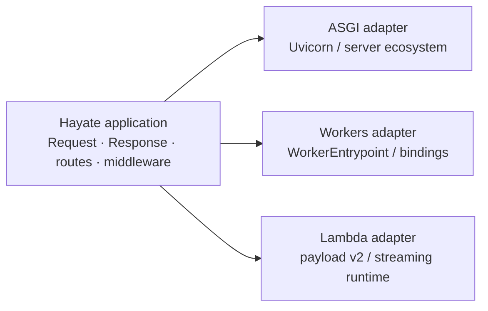

# Deployment model

Hayate treats deployment as an adapter around the same Fetch-style
application. The adapter translates platform input, output, lifecycle, and
bindings; it does not own routes or application policy.

## Portability is verified, not assumed

The ecosystem gate builds an unpublished core wheel and installs it into
downstream packages. The golden application additionally executes a real
Uvicorn/SQLite flow and a real Workerd/D1 flow.

Platform-specific behavior remains documented:

- ASGI owns server lifecycle and WebSocket transport.
- Workers owns environment bindings and `waitUntil`.
- Lambda owns event translation and Runtime API streaming.

Choose a boundary: [ASGI](asgi.md), [Cloudflare Workers](workers.md), or
[AWS Lambda](lambda.md).
